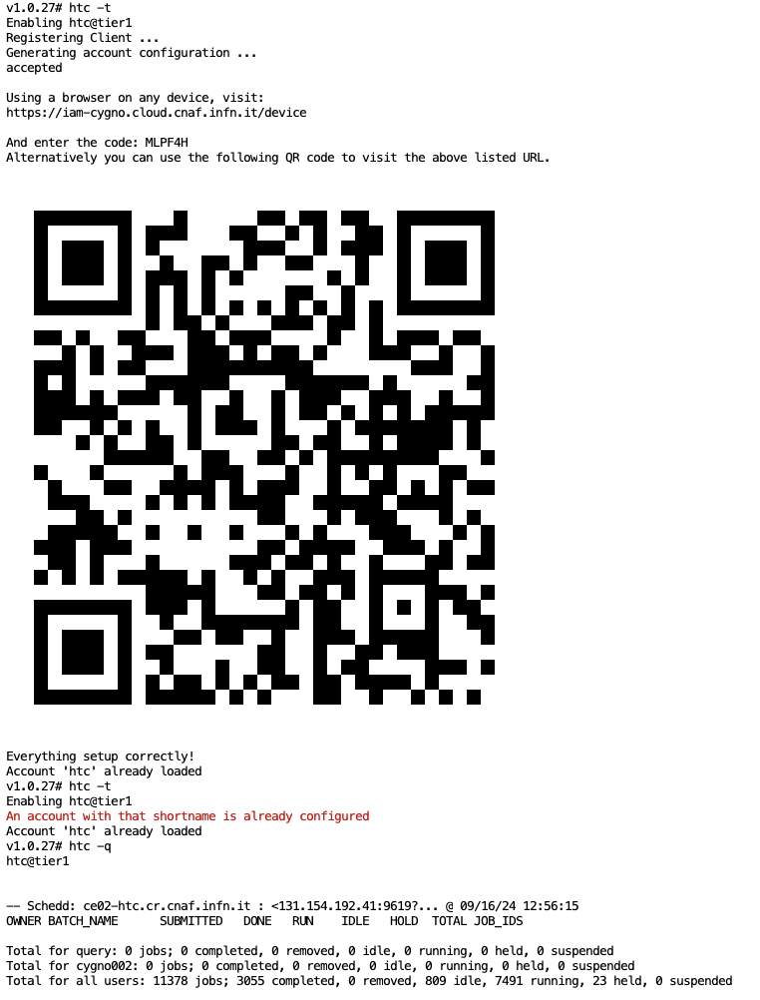

# CYGNO Condor Queue

Submit jobs on CYGNO condor INFN Cloud queue

there are two ways to submit a job under the experiment queue:
* access to cloud https://notebook.cygno.cloud.infn.it/ Open a terminal and follow the [instructions for Cygno Condor Cloud](https://github.com/CYGNUS-RD/mycondor#cygno-condor-cloud)
* Download and install Docker for your platform (e.g. your laptop) [https://docs.docker.com/get-docker/](https://docs.docker.com/get-docker/) and use Cygno Condor Container from your PC or server, etc. and then follow the [istruction for Cygno Condor Container](https://github.com/CYGNUS-RD/mycondor#cygno-condor-container)

### Cygno Condor Cloud in your notebook (once forever)
* connect to cygno cloud interface:  https://notebook.cygno.cloud.infn.it
* to setup condor access permanently please set (where USERNAME is your username)
  ```
  vi /jupyter-workspace/cloud-storage/USERNAME/.bashrc
  ```
  * put this code in your bash file
  ```
  # config condor CYGNO queue
  cat > /etc/condor/condor_config.local << EOF 
  AUTH_SSL_CLIENT_CAFILE = /etc/pki/ca-trust/source/anchors/htcondor_ca.crt
  SCITOKENS_FILE = /tmp/token
  SEC_DEFAULT_AUTHENTICATION_METHODS = SCITOKENS
  COLLECTOR_HOST = 131.154.98.46.myip.cloud.infn.it:30618
  SCHEDD_HOST = 131.154.98.46.myip.cloud.infn.it
  EOF

  alias condor_job_detail='condor_q -all -format "-----------------------------------------\n\nClusterID: %d\n" ClusterId -format "JobStatus: %d\n" JobStatus -format "CygnoUser: %s\n\n" CygnoUser'
  
  alias condor_my_jobs='condor_q -all -format "ClusterID: %d " ClusterId -format "JobStatus: %d " JobStatus -format "CygnoUser: %s\n" CygnoUser | grep $USERNAME' 
  ```
  * close and re-open your terminal, now the queues are configured forever (this is valid for any cluster configured under condor)

* to submit your job **open a terminal** and follow the instructions below to [submit a job](https://github.com/CYGNUS-RD/mycondor/blob/main/README.md#submit-a-job)

- Queue 1 **reserved** to reco: 131.154.98.50
- Queue 2 public:               131.154.98.168
- Queue Sym and public:         131.154.98.46

### Cygno Condor Container (optional)
download Cygno Condor Container configuration 

    git clone https://github.com/CYGNUS-RD/mycondor.git
    cd mycondor/

in the directory ***private*** you will find an example and there you have to copy/move your code to be submitted. The folder is shared with the running container and continuously updated

run Cygno Condor Container 
```
docker-compose up -d
```      
      
then follow the instruction below to [submit a job](https://github.com/CYGNUS-RD/mycondor/#submit-a-job) 
ONLY on Container (not from Notebook terminal) you need to get the token any time you need with the command **gettoken** to the prompt

      [root@5045c42ec547 /]# gettoken
    
follow the instructions and press enter to any question (do not enter any password) 
      
### Submit a job 
check if all is right e.g. monitoring the condor queue status

      [root@5045c42ec547 /]# condor_status
      Name                    OpSys      Arch   State     Activity LoadAv Mem   ActvtyTime

      wn-pod-7b4747c8cd-bq9d5 LINUX      X86_64 Unclaimed Idle      0.000 7959  8+01:45:21
      wn-pod-7b4747c8cd-ljslg LINUX      X86_64 Unclaimed Idle      0.000 7959  2+00:21:34
      wn-pod-7b4747c8cd-r52dg LINUX      X86_64 Unclaimed Idle      0.000 7959  8+01:35:19
      wn-pod-7b4747c8cd-sfqh7 LINUX      X86_64 Unclaimed Idle      0.000 7959  8+01:35:21
      wn-pod-7b4747c8cd-sksm4 LINUX      X86_64 Unclaimed Idle      0.000 7959  8+01:25:06

                     Machines Owner Claimed Unclaimed Matched Preempting  Drain

        X86_64/LINUX        5     0       0         5       0          0      0

               Total        5     0       0         5       0          0      0

Now you are up and running. On in the container shell you can change the directory to the shared folder with your PC where you can put your software. On the cloud you have to change the directory and upload via web interface your software/directory with your code. The **private** is a permanent directory.

      cd private/

to access and test your code, follow the instructions below for more details: 

* condor@INFN [https://codimd.infn.it/s/VD3RWisM6#Submitting-a-demo-job](https://codimd.infn.it/s/VD3RWisM6#Submitting-a-demo-job)
* file IO [https://codimd.infn.it/s/pbisNdDlN](https://codimd.infn.it/s/pbisNdDlN) [esempio](https://github.com/CYGNUS-RD/cygno/blob/main/dev/presigned.py)

***Tip on containers***: you can exit when you like from the container and reconnect with ***docker exec -it mycondor_condor_1 /bin/bash*** command; to stop the container (you actually can have it running forever) give the command ***docker-compose down***; all the files are shared via the local folder ***mycondor/submituser*** also if you are not connected to the container; if you can't access the queues try first to refresh the token via ***gettoken*** command

file tranfer: https://htcondor.readthedocs.io/en/latest/users-manual/file-transfer.html

### Submit a job @ tier1

* since cygnolib **v1.0.18**, cygno_htc script to configure and monitor tier1/cloud has been included
* since notebook **gmazzitelli/cygno-lab:v1.0.27-cygno** cli htc has been setup to handle queue at tier1 and on cloud
* to configure the queue type ```htc -t```
* to go back to cloud queue (if you have configured as above) ```htc -c```
* to monitor the queue ```htc -q``` (type ```htc``` for help)
* if the queue lost configuration type again ```htc -t/-c```



Recostruction submit example:
* pull reconstraction repository
* crate a ***sub_reco*** file like following:
```
+SingularityImage = "docker://gmazzitelli/cygno-wn:v1.0.25-cygno"
Requirements = HasSingularity
executable = /home/mazzitel/reconstruction/exec_reco.sh

log    = reconstruction_77744.log
output = reconstruction_77744.out
error  = reconstruction_77744.error

should_transfer_files   = YES

transfer_input_files  = /home/mazzitel/reconstruction/index.php, /home/mazzitel/reconstruction/waveform.py, /home/mazzitel/reconstruction/ReadMe_PMT.md, /home/mazzitel/reconstruction/datasets, /home/mazzitel/reconstruction/.gitignore, /home/mazzitel/reconstruction/utilities.py, /home/mazzitel/reconstruction/cluster, /home/mazzitel/reconstruction/postprocessing, /home/mazzitel/reconstruction/submit_reco.py, /home/mazzitel/reconstruction/profiling.py, /home/mazzitel/reconstruction/energyCalibrator.py, /home/mazzitel/reconstruction/treeVars.py, /home/mazzitel/reconstruction/debug_code, /home/mazzitel/reconstruction/calibration.txt, /home/mazzitel/reconstruction/After_reco, /home/mazzitel/reconstruction/snakes.py, /home/mazzitel/reconstruction/configFile_MC.txt, /home/mazzitel/reconstruction/morphsnakes.py, /home/mazzitel/reconstruction/corrections, /home/mazzitel/reconstruction/cython_cygno.pyx, /home/mazzitel/reconstruction/cythonize.sh, /home/mazzitel/reconstruction/modules_config, /home/mazzitel/reconstruction/exec_reco.sh, /home/mazzitel/reconstruction/scripts, /home/mazzitel/reconstruction/plotter, /home/mazzitel/reconstruction/clusterTools.py, /home/mazzitel/reconstruction/pedestals, /home/mazzitel/reconstruction/reconstruction.py, /home/mazzitel/reconstruction/output.py, /home/mazzitel/reconstruction/cameraChannel.py, /home/mazzitel/reconstruction/data, /home/mazzitel/reconstruction/configFile_LNF.txt, /home/mazzitel/reconstruction/README.md, /home/mazzitel/reconstruction/configFile_MANGO.txt, /home/mazzitel/reconstruction/mva, /home/mazzitel/reconstruction/utils, /home/mazzitel/reconstruction/swiftlib.py, /home/mazzitel/reconstruction/configFile_LNGS.txt, /home/mazzitel/reconstruction/showOneImage.py, /home/mazzitel/reconstruction/rootlogon.C

transfer_output_files = reco_run77744_3D.root, reco_run77744_3D.txt

arguments             = configFile_LNGS.txt 77744 8 -1 96c209647473ef7273012cbbb2338266216c4123

queue
```
submit 
```
condor_submit sub_reco -spool -pool ce02-htc.cr.cnaf.infn.it:9619 -name ce02-htc.cr.cnaf.infn.it
```
```
condor_q XXXX -pool ce02-htc.cr.cnaf.infn.it:9619 -name ce02-htc.cr.cnaf.infn.it
condor_transfer_data XXXX -pool ce02-htc.cr.cnaf.infn.it:9619 -name ce02-htc.cr.cnaf.infn.it 
```
```
JOB=XXX; while true; do  condor_q ${JOB} -pool ce02-htc.cr.cnaf.infn.it:9619 -name ce02-htc.cr.cnaf.infn.it ; condor_transfer_data ${JOB} -pool ce02-htc.cr.cnaf.infn.it:9619 -name ce02-htc.cr.cnaf.infn.it; sleep 60; done
```
  
